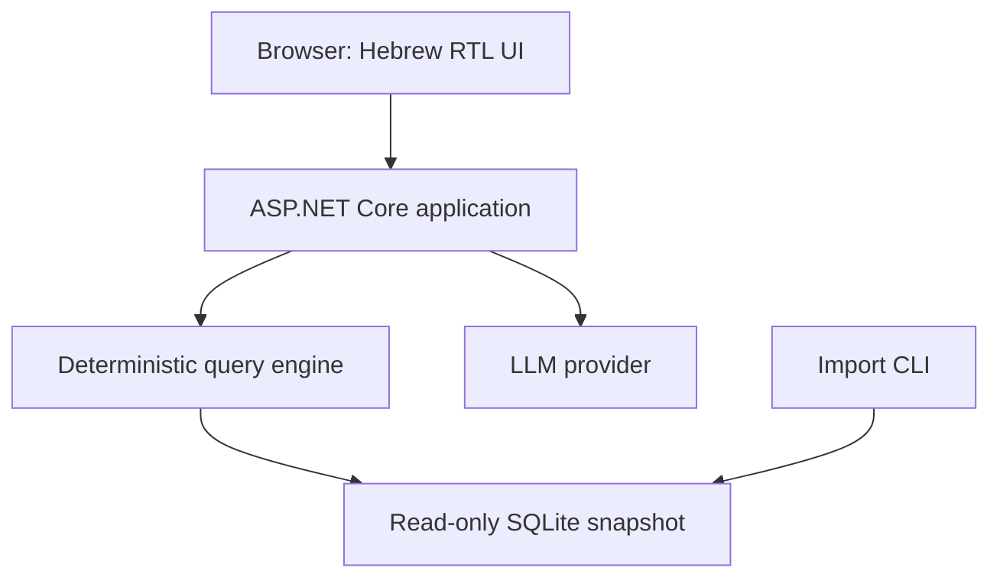

# Madlan Deal Explorer — Implementation Architecture

Status: architecture proposal; no application implementation has been started.

## 1. Recommended architecture

Build one ASP.NET Core application serving a small Hebrew RTL interface and JSON APIs. Use an immutable SQLite dataset generated by a CLI import command. Use one external LLM call to interpret each Hebrew question into a validated filter object. Perform filtering, eligibility decisions, calculations, and answer rendering deterministically.

Recommended stack: C# with .NET 10 / ASP.NET Core Minimal APIs; plain HTML, CSS, and JavaScript served from wwwroot; Microsoft.Data.Sqlite; CsvHelper for CSV parsing; xUnit for critical tests; a configured structured-output-capable LLM provider accessed through HttpClient. Pin compatible package versions during implementation.

This fits the engineer's C# experience and the five-hour constraint. Avoid a frontend build pipeline, ORM, conversation engine, generated SQL, or additional deployable services.

The core promise is: a CSM can answer a question, inspect the evidence, and explain a disputed number.

## 2. Requirements, evidence, and assumptions

### Confirmed by the assignment

Public working URL; Hebrew and RTL; meaningful LLM work; grounded answers with visible evidence; explicit data limitations; graceful model failure; meaningful tests and debugging; one-page CSM guide; honest AI development log; repository link. Approximately five focused hours, with three days to deliver.

### Inspected evidence

The supplied assignment and CSV were inspected. The CSV contains 530 rows, 520 unique deal IDs, six exact-duplicate ID groups, and four conflicting ID groups: D100017, D100124, D100032, and D100303. There are missing fields and inconsistent city, boolean, number, and date representations. Some dates have month precision only. No existing application repository was supplied.

These are file observations, not evidence that the sample is complete, current, or representative of the Israeli market.

### Inherited product decisions

Primary user: CSM. One workflow: query and explain transaction statistics. Read-only public demo, static full-dataset snapshots, median metrics, visible evidence, and manual-filter fallback. Conflicting deal groups are excluded from aggregates but remain inspectable.

### New architectural decisions

One process, one immutable SQLite file per deployed version, one model call, all deterministic query logic in C#, build-time ingestion, and redeployment to publish a new dataset. No runtime ingestion endpoint.

### Planning assumptions, not requirements

Plan for this approximately 500-deal sample and a handful of simultaneous demo users. Manual queries should ordinarily complete within one second at this size. The model has a 15-second total deadline; the browser stops waiting after 20 seconds. These are initial engineering targets, not measured performance.

### Consequential unknowns

Hosting account, model credentials, and API budget are not supplied. They block actual deployment or live model use, not architecture. Choose a host supporting a long-running .NET container, HTTPS, environment secrets, and public access. Verify its pricing and timeout settings during implementation. Configure the provider/model with credentials already available to the candidate; validate Hebrew intent extraction against the demonstration questions before accepting it.

## 3. Components and boundaries



| Component | Responsibility |
|---|---|
| Browser | Question input, manual filters, loading/error states, interpretation, metrics, evidence table, report inspection |
| API handlers | Input validation, deadlines, request IDs, rate limits, response mapping |
| QuestionInterpreter | One provider call; parse and validate a constrained interpretation; no data execution |
| QueryEngine | Filter canonical reports, determine deal eligibility, calculate medians, assemble evidence |
| Importer | Parse CSV, normalize, group reports, flag quality issues, build and validate a database |
| SQLite | Dataset metadata, original reports, normalized report values, deal grouping |
| External LLM | Language interpretation only; receives schema, bounded vocabulary, and question |

Keep these as files/classes inside one application project. Introduce only a small IQuestionInterpreter boundary to enable failure simulation and provider replacement. A second test project is sufficient.

Suggested files: Program.cs, Importer.cs, Normalizer.cs, QueryContracts.cs, QueryEngine.cs, QuestionInterpreter.cs, DatasetReader.cs, wwwroot/index.html, wwwroot/app.js, wwwroot/styles.css, and docs/.

All request operations are synchronous HTTP request/response workflows, with asynchronous waiting for the external model. No job queue or browser polling is necessary. Ingestion runs offline as a CLI command.

## 4. End-to-end flows

### Natural-language query

1. Browser submits a standalone question to POST /api/interpret.
2. Server checks length, rate limit, and global model-call allowance.
3. Interpreter sends supported fields, canonical vocabulary, date policy, and question to the provider.
4. Server validates the structured output. Supported results are query, clarification_required, or unsupported.
5. Browser displays the interpreted filters and automatically calls POST /api/query for a valid query.
6. QueryEngine uses the immutable dataset, computes eligible groups and statistics, and returns evidence and warnings.
7. Browser renders deterministic Hebrew labels and explanations. User can edit filters and rerun without the model.

Splitting interpretation from querying is intentional: manual fallback uses exactly the same query engine, and the browser can show what the model understood. It costs one additional local API round trip but no additional model call.

Invalid model output never reaches QueryEngine. A wrong but schema-valid interpretation remains a possible failure: show filters prominently, test representative questions, and allow correction. Schema validation alone does not prove semantic correctness.

### Manual query

Browser submits a filter object directly to /api/query. Apply the same validation and calculation rules. Model health must not affect this path.

### Data import and publication

1. Run the application in import mode, for example: dotnet MadlanExplorer.dll import input.csv output.sqlite.
2. Validate expected headers, UTF-8 parsing, and required identifiers. Reject structurally invalid files; retain individual field errors as report flags.
3. Preserve each source row and its ordinal; normalize each report.
4. Group by deal ID. Identify identical normalized reports versus conflicting reports.
5. Build a new database at a temporary path using a database transaction.
6. Validate row accounting, foreign keys, dataset metadata, and representative calculations.
7. Close the database and rename the completed file to the output artifact.
8. Package that file into a new application container and deploy only after checks pass.

A failed import leaves the current deployed dataset untouched. Reimporting identical CSV bytes and policy versions yields the same dataset identity and counts. The CLI does not append rows into an existing database.

Publishing a new dataset requires redeployment in the MVP. The hosting platform should activate a healthy version and retain the previous image for rollback. Never overwrite a database file being used by a running process.

## 5. Data model and correctness rules

### Essential tables

| Entity | Key and fields |
|---|---|
| Dataset | dataset_id; file_sha256; source_filename; imported_at; schema_version; normalizer_version; policy_version; raw_row_count; unique_deal_count; date_coverage |
| Deal | (dataset_id, deal_id); status = usable/conflicting/unusable; canonical_report_id nullable; flags_json |
| Report | report_id; dataset_id; deal_id; source_row_number; raw_json; normalized_json; fingerprint; flags_json; reported_source |

One Dataset row exists in each deployed database. Each source row remains a Report, including duplicate rows. Deal is a grouping entity, not a claim that any reported source is externally verified.

For this volume, keep normalized report fields in typed application DTOs serialized as JSON. Load the snapshot into immutable typed objects at startup. SQLite provides durable provenance and grouping; in-memory C# filtering avoids building a generic SQL query framework for 520 deal groups. Do not claim this implementation is optimized for millions of records.

Preserve the original CSV in the private application data directory for exact source recovery; do not put it in wwwroot. Report raw_json preserves original field strings.

### Types and normalization

- Store money in integer agorot and room/area values as invariant decimal strings in normalized JSON; parse to C# decimal. Never use floating-point arithmetic for money.
- Preserve booleans as true, false, or null. Unknown values produce flags.
- Trim/collapse whitespace and apply a reviewed explicit city alias map. Do not use fuzzy matching that silently changes location.
- Normalize neighborhood only within its city; do not merge differently named neighborhoods without a documented alias.
- Parse numeric separators and optional known suffixes explicitly. Never repair an unrecognized number by guessing.
- Slash dates are day/month/year for this Israeli dataset. Document this assumption. Support ISO, dot-separated dates, and explicit English month-year formats.
- Represent dates as inclusive date_start/date_end with precision day/month/unknown. For a month-only value these bounds describe uncertainty, not an invented transaction day.

SQLITE numeric typing does not provide an exact decimal money model automatically; keeping scaled integers and performing decimal calculations in C# makes the precision policy explicit.

### Duplicate and conflict policy

Compare normalized business values and reported source, excluding row ordinal and ingestion metadata. Identical fingerprints within a deal group have one canonical report for calculations but retain all raw reports.

If a group contains differing normalized reports, mark the deal conflicting and do not choose a winning report. Four conflicting IDs in the supplied sample should therefore contribute to no aggregate metric.

### Eligibility and calculations

First determine possible filter matches. For usable deals, the canonical report is decisive. For conflicting deals, inspect all distinct reports to identify potential matches, but do not calculate from any of them.

Track:
- matched eligible deal IDs;
- definitely matching but excluded IDs;
- possibly matching IDs where missing values or partial dates prevent a decision.

Keep these categories distinct. “Possibly matching” must not inflate the transaction count.

A date interval fully inside the query interval is eligible. Partial overlap is uncertain and excluded with an explanation; disjoint intervals do not match. With no date filter, an unknown date alone does not exclude a valid price.

Compute transaction count from usable, definitively matching deals. Price metrics require a positive valid price; price-per-square-meter additionally requires positive valid area. Show each metric's contributing IDs and sample size.

Median: sort full-precision decimal values; for an even sample use the mean of the two central values. Return null for an empty sample. Round only for display; show monetary metrics to the nearest shekel and document the rounding rule.

Recompute price per square meter. Flag a discrepancy when the supplied value differs by more than max(1 NIS/sqm, 1% of the calculated value). This is a diagnostic tolerance, not evidence that price or area is correct.

Flag positive transaction prices below 100,000 NIS as suspicious using a documented configurable review threshold. Keep them eligible and show a prominent warning; the threshold is an MVP heuristic, not a claim about property value. Do not automatically reject expensive transactions.

Show a small-sample warning below five contributing transactions. This threshold is a product heuristic, not a statistical confidence calculation.

## 6. API contracts

| Operation | Purpose |
|---|---|
| GET /api/dataset | Dataset version, coverage, available filter vocabulary |
| POST /api/interpret | Interpret one question; no calculations |
| POST /api/query | Run validated filters and return metrics plus evidence |
| GET /api/deals/{dealId}?datasetId=... | Original reports, canonical values, quality flags and policy |
| GET /healthz | Process liveness |
| GET /readyz | Dataset loaded and validated |

The demo can return all matching evidence at this scale in one query response; render it in browser pages of 50 rows. Metrics always use the complete matched set. Server pagination is deferred.

Illustrative interpretation request:

```json
{
  "question": "מה חציון המחיר של דירות 4 חדרים בחולון בשנת 2025?"
}
```

Illustrative validated interpretation:

```json
{
  "status": "query",
  "filters": {
    "city": "חולון",
    "neighborhood": null,
    "propertyType": "דירה",
    "roomsMin": 4,
    "roomsMax": 4,
    "dateFrom": "2025-01-01",
    "dateTo": "2025-12-31"
  },
  "requestId": "..."
}
```

POST /api/query accepts datasetId and the same filters. Reject unknown fields, unrecognized vocabulary, inverted ranges, and invalid dates. All filters combine with AND. Room bounds are inclusive and exact: four rooms does not include 3.5 or 4.5.

Response shape:

```text
{
  requestId, datasetId, policyVersion, appliedFilters,
  metrics: {
    transactionCount,
    medianPriceNis: { value, sampleSize, contributingDealIds },
    medianPricePerSqm: { value, sampleSize, contributingDealIds }
  },
  eligibleDeals: [...],
  excludedDeals: [{ dealId, metricReasons, matchingStatus }],
  warnings: [{ code, affectedDealIds }],
  calculationDefinitions
}
```

This is a contract sketch, not an actual dataset result. Numeric values must come from execution.

Use fixed Hebrew messages for unsupported and error categories. A clarification response identifies the missing field and presents a bounded question or editable filter; no ongoing chat session is required.

Errors use { requestId, code, messageHe, retryable }. Use HTTP 400 for invalid requests, 409 for a dataset-version mismatch, 429 for rate limiting, 502 for invalid provider output, 503 for unavailable dependencies, and 504 for the model deadline. Clarification and unsupported questions are valid 200 interpretation responses.

## 7. LLM contract, reliability, and security

The prompt describes a parser, allowed capabilities, and canonical vocabulary. Include the server's current date only to resolve explicit relative periods; never default an omitted period to recent transactions. Resolve “last year” as the previous calendar year and expose its exact dates. If a location or period cannot be represented safely, request clarification.

Use provider structured output where available and local strict deserialization and semantic validation in all cases. No model tools, browsing, database access, file access, or generated code. User questions and dataset text remain untrusted data.

Initial configurable limits:
- question length: 1,000 characters;
- body size: 16 KiB;
- model deadline: 15 seconds, including connection and response;
- no automatic model retries;
- at most two concurrent provider calls;
- per-IP interpretation rate limit: five per minute;
- single-process global allowance: 100 interpretation calls per UTC day;
- bounded output tokens, for example 500, subject to provider semantics.

These numbers are operational defaults, not assignment requirements. In-process quotas reset after restart. Set a provider-side spending cap where supported; do not present the local allowance as a durable billing guarantee.

Keep credentials in hosting secrets, never repository or browser code. Serve same-origin UI/API with HTTPS, no broad CORS policy, and HTML-escape every report field and model-derived value. Trust forwarded client IPs only from the configured hosting proxy. Do not expose import or diagnostic-failure switches as public write endpoints.

Structured logs include request ID, app revision, dataset/policy version, validated filters, duration, provider status, and error category. Avoid logging secrets or raw question text by default. User-visible request IDs should help a CSM report an issue.

Readiness depends on local data availability, not model availability, because manual filtering can still work. Show model-specific failure on the attempted interpretation. Inject a fake interpreter in automated tests and use an operator-controlled environment setting on a separate demo deployment to demonstrate failure.

## 8. Deployment and technology tradeoffs

Deploy one container with the app, wwwroot, the CSV, and completed SQLite file. Run as a non-root user, open SQLite read-only, and write logs to stdout. No persistent volume is required because the durable snapshot belongs to the deployment artifact. Keep data outside static-file routes.

Before publishing, verify HTTPS, browser accessibility, environment secrets, health probes, and the model call. Host selection and price remain implementation prerequisites, not verified facts in this proposal.

| Decision | Alternative | Reason |
|---|---|---|
| C# Minimal APIs and static JS | React plus separate backend | Familiar server stack and fewer build/deployment steps |
| SQLite artifact | Managed PostgreSQL | Static small dataset does not require runtime writes or shared mutable state |
| Typed in-memory query engine | SQL query generator | Easy decimal medians, eligibility explanations, and exhaustive evidence at this volume |
| Structured interpretation | Unrestricted generated SQL | Model cannot expand execution privileges |
| One model call | LLM-generated numerical explanation | Lower cost and no second factual-generation boundary |
| Snapshot redeploy | Runtime import workflow | Safe replacement and rollback with less administrative UI |

The query engine should depend on typed dataset records, so switching storage later does not change metric definitions. Do not create generic repository frameworks or abstract every class.

## 9. Implementation sequence: approximately five hours

| Time box | Milestone | Completion condition |
|---|---|---|
| 0:00–0:30 | Vertical slice and hosting smoke test | One deployed RTL page calls an API and displays a calculation from a few parsed CSV records |
| 0:30–1:30 | Import and correctness rules | Full sample produces a snapshot; duplicate/conflict/date policies have focused tests |
| 1:30–2:20 | Query and evidence UI | Manual Holon query shows all three metrics, sample counts, reports, and exclusions |
| 2:20–3:10 | LLM interpretation | Live Hebrew question creates validated filters; timeout/invalid-output paths terminate cleanly |
| 3:10–4:00 | Reliability and public deployment | Limits, request IDs, health checks, and immutable dataset work at public URL |
| 4:00–5:00 | Verification and handoff | Core tests pass; CSM guide, real AI log, README, and demo scenarios are ready |

These are delivery estimates. Start testing and logging AI mistakes during development, not in the last milestone. If time runs short, reduce visual polish and optional inputs before cutting evidence, fallback behavior, or required deliverables.

## 10. Verification plan and MVP evolution

Use small manually verified fixtures for expected calculations, alongside regression checks on the supplied sample. Do not rely solely on an expected value generated by the same implementation.

Critical checks:
- All 530 raw rows survive import; 520 deal groups exist; six duplicate groups do not inflate counts; all four conflicting groups are excluded.
- Format variations normalize correctly, and unknown booleans stay null.
- Missing area still permits price median where otherwise eligible.
- Zero price is excluded; suspicious positive price is visible and flagged.
- Price-per-square-meter discrepancies retain both original and recomputed values.
- Month-only dates handle full containment, partial overlap, and no date filter correctly.
- Even/odd medians, empty metrics, sample sizes, and final rounding are correct.
- Every contributing ID exists in the returned evidence.
- Reimport is idempotent; malformed import leaves the existing artifact unchanged.
- Unknown filters, malicious extra model fields, inverted dates, and malformed JSON are rejected.
- Model timeout, invalid output, and provider outage preserve manual querying.
- UI renders Hebrew RTL, escapes hostile text, and clearly distinguishes previous results after failure.

Run a small live-provider evaluation: exact room counts, city aliases, explicit date ranges, a vague “cheap apartment” request, an unsupported valuation request, and an instruction to bypass restrictions. Live evaluation checks interpretation quality; deterministic tests remain independent of provider availability.

Future additions need concrete triggers:
- Managed database and runtime import: multiple administrators or frequent shared updates.
- Server pagination/indexed queries: measured dataset size or response latency makes full evidence impractical.
- Distributed quotas: multiple application replicas.
- Incremental reconciliation: a source supplies reliable updates and stable identifiers.
- Embeddings: a genuine unstructured-text retrieval requirement.
- Multi-turn interaction: demonstrated user need that editable filters cannot satisfy.

Property valuation, forecasts, maps, live feeds, account systems, public uploads, and investment advice remain outside this MVP.

## 11. Technical review and customer demonstration

Be ready to explain:
- Why CSM is the chosen user and language interpretation is meaningful LLM work.
- Why filtering and facts remain deterministic.
- Why schema-valid model output can still be semantically wrong.
- Why conflicting reports are excluded rather than resolved by an invented source hierarchy.
- Why metric sample sizes differ and why medians use unrounded values.
- Why immutable deployment artifacts avoid persistent-volume and live-update complexity.
- Which limits are planning defaults and which facts were observed in the CSV.

Prepare three demonstrations: a valid Hebrew query, inspection of a disputed report such as D100017, and a model failure followed by successful manual filtering.

For the customer moment, reproduce the filters and dataset version, inspect the reports and eligibility rules, identify whether the issue is data, interpretation, or calculation, and explain only what is established. A reported source label is provenance from the CSV, not independent verification against that source.

The CSM guide should explain those same steps in plain language and provide a response template. The AI log must document an actual mistake caught during implementation; do not manufacture an incident to satisfy the requirement.

## Technical references

Official documentation consulted for stack feasibility:
- [ASP.NET Core Minimal API tutorial](https://learn.microsoft.com/en-us/aspnet/core/tutorials/min-web-api?view=aspnetcore-10.0)
- [ASP.NET Core rate limiting](https://learn.microsoft.com/en-us/aspnet/core/performance/rate-limit?view=aspnetcore-10.0)
- [Microsoft.Data.Sqlite data types](https://learn.microsoft.com/en-us/dotnet/standard/data/sqlite/types)

These references support framework capabilities and type behavior; they do not verify any hosting provider, model performance, package installation, or application implementation.

